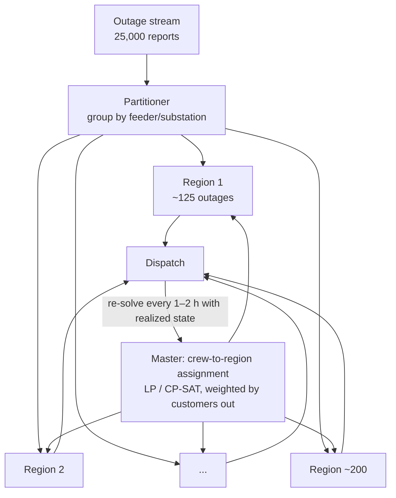

# Scaling to 2,000 crews and 25,000 outages (under uncertainty)

Why the toy examples don't just "run bigger," and how real systems
decompose the problem so it stays solvable — and re-solvable — at
statewide scale.

## 1. Why it blows up

Three different things break, and they break independently:

**Combinatorics.** VRP is NP-hard; the number of feasible solutions grows
factorially. Practically, metaheuristics don't enumerate — they search
neighborhoods — but neighborhood sizes and evaluation costs grow too. An
instance with 25,000 stops is ~250× Example 3, and solve quality at a
fixed time budget degrades badly past a few thousand stops even for
state-of-the-art solvers.

**The matrix.** 25,000² = 625 million origin–destination pairs. At 4 bytes
each that's 2.5 GB before you've optimized anything, and computing it
naively (25,000 Dijkstras over CT's road network, ~500k edges) takes
hours. Nobody builds the full matrix:
- **Sparse candidate lists**: each stop only ever connects to its ~20
  nearest neighbors in a good solution (LKH is built on this insight).
- **Fast routing engines**: OSRM/Valhalla with contraction hierarchies
  answer point-to-point queries in ~1 ms; compute distances on demand
  and cache.

**Coupling + uncertainty.** Precedence chains link repairs across crews;
and the instance itself is wrong an hour after you solve it (see §4).
A monolithic "solve once, optimally" framing is the wrong goal entirely.

## 2. Decomposition: making sub-problems

The art is cutting along seams where the coupling is weakest.

### Structural decomposition (the grid gives it to us for free)

Outages on different feeders share **no precedence constraints** — the
electrical hierarchy is a forest, and constraint chains never cross
trees. So the 25,000-outage problem splits *exactly* (not approximately)
into per-feeder/per-substation sub-problems:

```
25,000 outages  ->  ~200 feeder regions  x  ~125 outages each
```

Each region is the size of Example 4 — solvable to near-optimality in
under a minute. The only thing the regions share is the *crew pool*.

### Hierarchical decomposition (master + workers)

That shared crew pool becomes a small master problem:



- **Master** (top): assign crews to regions — a transportation/assignment
  LP or CP-SAT model with ~2,000 × 200 variables. Trivial to solve;
  objective = expected CMI reduction per crew-hour in each region.
- **Workers** (bottom): each region solves its weighted-latency VRP
  independently. This is the formal structure of Dantzig–Wolfe /
  column-generation approaches, applied heuristically.

### Spatial decomposition (when there's no grid to follow)

For the plain trucking version (no electrical hierarchy), partition
geographically: k-means/k-medoids on road-network distance, or sweep
algorithms (cluster-first, route-second). The catch is **boundary
effects** — stops near a border may be cheaper to serve from the
neighboring region. Mitigations: overlap zones solved in both regions,
or periodic re-partitioning. Accept ~2–5% optimality loss for a 100×
speedup; at this scale that trade is a bargain.

### Temporal decomposition (rolling horizon)

Don't plan a crew's full 16-hour shift — plan the next 3–5 jobs in
detail and treat the rest as an aggregate "tail estimate." Then re-solve
as reality unfolds. This is model-predictive control applied to
dispatch, and it's also the main weapon against uncertainty (§4).

## 3. Parallelization

Once decomposed, the workers are **embarrassingly parallel**:

- ~200 region problems × <60 s each ÷ 32 cores → a full statewide
  re-plan every ~6 minutes, forever. (`multiprocessing`, Ray, or cloud
  batch — the structure doesn't care.)
- **Portfolio parallelism** on hard regions: run the same instance with
  different seeds/strategies (GLS, HGS, different first solutions) and
  take the best — metaheuristics have high variance, so portfolios beat
  single long runs.
- GLS/HGS are **anytime algorithms**: every region always has a current
  best plan; a re-plan request never blocks on optimality.

## 4. Uncertainty: the part that changes the philosophy

At storm scale you are not solving a problem — you are operating a
**policy** over a problem that keeps changing:

| Source | Typical magnitude |
|--------|-------------------|
| Unassessed damage | You know ~30% of true damage in hour 1; reports arrive for 24–48 h |
| Repair durations | "45-minute" jobs become 4 h (broken pole vs. tripped fuse) |
| Travel times | Roads blocked by the same trees that took the lines down |
| Crew availability | Mutual-aid crews arrive in waves; crews time out (16-h limits) |
| Secondary failures | Energizing reveals nested damage; cold-load pickup trips feeders |

The toolbox, in order of practical importance:

1. **Rolling-horizon re-optimization (reactive).** The workhorse. Plan,
   execute 1–2 h, re-solve with realized state. Requires only that your
   solver is *fast* — which decomposition bought you. Key insight: **a
   plan's value decays in hours, so re-solve speed beats solve quality.**
   A 2%-worse plan recomputed every 15 min dominates a perfect plan
   recomputed daily.
2. **Two-stage stochastic programming (proactive).** Before landfall:
   weather forecast → damage-prediction model (utilities really run
   these) → scenarios of outage patterns → optimize crew **staging and
   mutual-aid requests** against the scenario set (sample average
   approximation). First-stage decisions = where crews sleep tonight;
   recourse = the routing you'll do tomorrow.
3. **Buffers / chance constraints.** Pad repair times at the 75th–90th
   percentile instead of the mean; schedule fewer jobs per crew than the
   point estimates allow. Cheap, robust, widely used.
4. **Robust optimization.** Optimize against the worst case in an
   uncertainty set. Strong guarantees, conservative plans — better for
   pre-positioning than for live dispatch.
5. **Policy learning (ADP/RL).** Learn dispatch policies directly
   (Powell's approximate dynamic programming for fleets is the classic
   line of work). Research-grade for this domain, but a natural lecture
   endpoint — and where the field is heading.

## 5. The architecture, end to end

```
BEFORE THE STORM
  weather model -> damage forecast (ML) -> scenario set
  -> two-stage stochastic program -> crew staging + mutual aid requests

DURING RESTORATION (loop every ~15-60 min)
  new outage reports ------\
  crew status updates ------+--> partitioner (by feeder)
  revised repair estimates -/         |
                              master: crews -> regions   (LP/CP-SAT, seconds)
                                      |
                              ~200 region VRPs in parallel (<1 min each)
                                      |
                              dispatch next 1-3 jobs per crew only
```

## 6. The experiment that proves it (proposed: Example 5)

Take the Example 4 toy and make it dynamic:

- Reveal only 40% of damages at t=0; the rest arrive on a Poisson stream
  over 6 simulated hours.
- Draw actual repair times from a lognormal around the estimates.
- Compare three dispatch policies on realized CMI:
  (a) **static** — solve once at t=0, never adapt;
  (b) **greedy** — each free crew takes the highest customers/hour job;
  (c) **rolling horizon** — re-solve the weighted-latency VRP every 30
  simulated minutes.

The expected result — static is terrible, greedy is surprisingly decent,
rolling horizon wins — is the entire scaling story in one chart.
